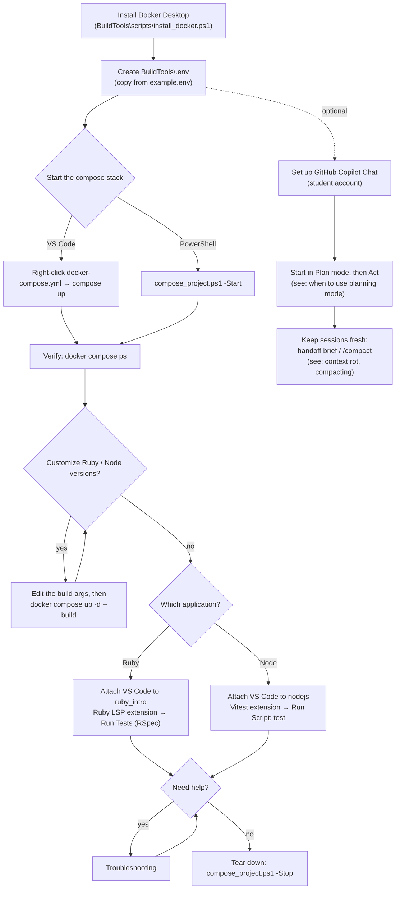
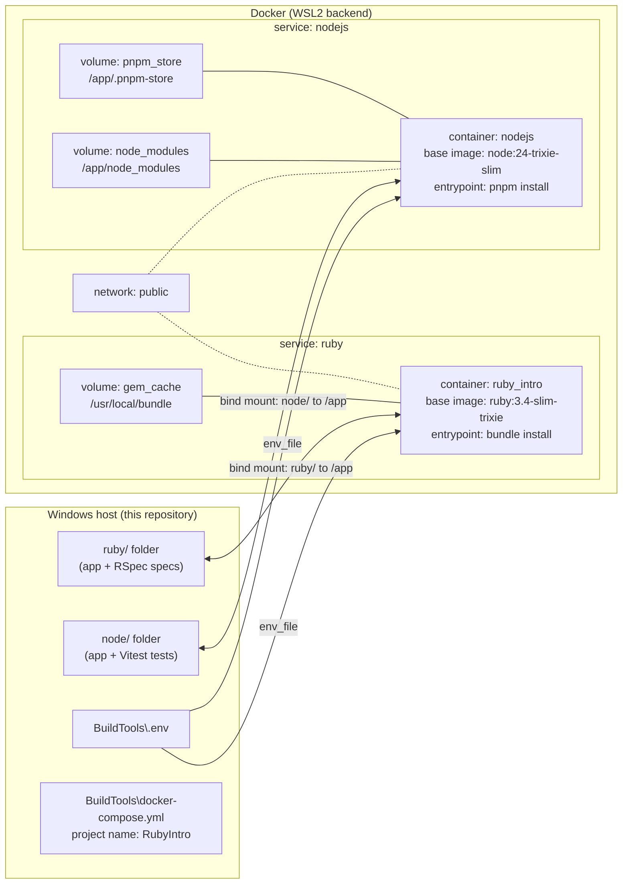

# CSC ECE 517 Project 1

This repository contains two small example applications and a shared Docker toolchain
for running and testing them:

| Service | Container name | Base image           | App directory | Test runner |
| ------- | -------------- | -------------------- | ------------- | ----------- |
| ruby    | ruby_intro     | ruby:3.4-slim-trixie | ruby/         | RSpec       |
| nodejs  | nodejs         | node:24-trixie-slim  | node/         | Vitest      |

Each application includes a small example (a string matching function) and a matching
test so you can practice writing and running tests inside a container.

**Contents**

- [Install Docker Desktop](#install-docker-desktop)
- [VSCode](#vscode)
  - [Deploy Docker Compose Stack](#deploy-docker-compose-stack)
  - [The compose stack](#the-compose-stack)
  - [Verify the stack is running](#verify-the-stack-is-running)
  - [Rebuilding the image](#rebuilding-the-image)
  - [Customizing the Ruby and Node versions](#customizing-the-ruby-and-node-versions)
  - [Connecting to a container with VSCode](#connecting-to-a-container-with-vscode)
- [Running Tests on NodeJS container](#running-tests-on-nodejs-container)
- [Running Tests on the Ruby_Intro container](#running-tests-on-the-ruby_intro-container)
- [Tear down the docker project](#tear-down-the-docker-project)
- [Troubleshooting](#troubleshooting)
- [VS Code instructions for CoPilot/Chat](#vs-code-instructions-for-copilotchat)
  - [Signup for GitHub Education Benefits](#signup-for-github-education-benefits)
  - [To use Copilot Chat in VS Code](#to-use-copilot-chat-in-vs-code)
  - [When to use planning mode to reduce token utilization](#when-to-use-planning-mode-to-reduce-token-utilization)
  - [Context Rot](#context-rot)
  - [Agents.md Instructions](#agentsmd-instructions)
  - [Prompt handoffs](#prompt-handoffs)
  - [Compacting](#compacting)



## Install Docker Desktop
You can use the install_docker.ps1 powershell script to install docker
If doing so ensure you are using an **administrative prompt**
- Click on your Start Windows Icon
- Search for Powershell
- Right-Click on Powershell and select `Run as Administrator`
- Then cd to the directory this repository lives in

```
& BuildTools\scripts\install_docker.ps1
```

When installing docker desktop, it will enable the WSL feature, since we run docker on wsl

**Notes:**
- If WSL wasn't previously enabled you will need to restart and run the installer a second time to ensure
WSL is installed and available for Docker
- Your computer must also support Virtualization which is a BIOS setting, if it's not enabled, you may need to enable it
  within your BIOS settings

## VSCode
**_Docker Desktop must be installed first_**

### Deploy Docker Compose Stack

> **Prerequisite - create the `.env` file**
> The compose file expects a `.env` file in the `BuildTools` folder. Since `.env` is
> git-ignored, copy the provided template first:
>
> ```powershell
> Copy-Item BuildTools\example.env BuildTools\.env
> ```
>
> Without this file, `compose up` fails with an "env file ... not found" error.

Expand the BuildTools Folder

Right-Click docker-compose.yml and click compose up

> Note: For windows users
> 
> There is a compose_project.ps1 script that will start up and destroy the docker compose project for you
> Run ./BuildTools/scripts/compose_project.ps1 in Powershell to read how to use it

### The compose stack



The app code lives on your machine and is bind-mounted into each container at `/app`, so
code changes are picked up immediately. The named volumes persist the installed
dependencies (`gem_cache`, `pnpm_store`, `node_modules`) between container restarts and
rebuilds. Both services share the `public` network and are kept alive by their default
`sleep infinity` command, so you can attach and interact with them.

### Verify the stack is running

```powershell
docker compose -f BuildTools\docker-compose.yml ps
```

You should see the `ruby_intro` and `nodejs` containers in a `running` state.
If a container shows `Restarting` instead, read its logs to see why it keeps failing:

Example to view the ruby_intro logs

```powershell
docker compose -f BuildTools\docker-compose.yml logs --tail 50 ruby_intro
```

### Rebuilding the image

`compose up` only builds an image if it does not exist yet. If you change a `dockerfile`,
the `Gemfile`, or the `package.json`, rebuild and restart the services:

```powershell
docker compose -f BuildTools\docker-compose.yml up -d --build
```

### Customizing the Ruby and Node versions

The base images are controlled by the build args in `BuildTools\docker-compose.yml`:

```yaml
args:
  - RUBY_VERSION=3.4
  - RUBY_OS=slim-trixie
```

These match the `ARG` defaults in `BuildTools\ruby\dockerfile` and are interpolated into the
`FROM` line, so the image is built from `ruby:3.4-slim-trixie`. Change the values to any
existing upstream tag (for example `RUBY_VERSION=3.3` with `RUBY_OS=slim-bookworm`, or
`NODE_VERSION=22` with `NODE_OS=bookworm`) and rebuild with `up -d --build`.
Switching versions changes the base image, so expect a full rebuild.

### Connecting to a container with VSCode

Ensure you have the Container Tools extension by Microsoft installed

- Click on the ContainerTools icon in your sidebar. 
- Expand the "Containers" section
- Expand the rubyintro project
- Right-click on the nodejs or ruby_intro container that's running
- Select "Attach Visual Studio Code"
  - this will launch a new VS Code instance that is running within the container

You are now able to interact with the docker container's code directly

## Running Tests on NodeJS container
- Connect to the NodeJS container
- Install the Vitest Extension
- After you install the vitest extension it will ask you to restart vscode to see the extension
- Press CTRL + SHIFT + P to open the command palette
- Enter "Developer: Restart Extension Host", this will reload the vscode instance connected to the container
- When you see "Cannot reconnect. Please reload the window." Press "Reload Window"

Write your TypeScript file and test file.  **An example .ts and .test.ts is included**

To run a test, click on the Run/Debug icon in the left navbar. 

Click the green play button at the top of the screen beside Run and Debug.

Beside the play button there's a dropdown.  Select `Node.js...` then select `Run Script: test`

The call stack will show the tests running.  The bottom center of the screen will show a DEBUG CONSOLE

Your test results will then be displayed in the terminal window tab.

> NOTE:
> 
> From the `Node.js...` selection you can also select `Run Script: test:watch`.
> This will watch your changes and when you press save the tests immediately run.

To stop a test at the top center of the screen press the stop icon.

## Running Tests on the Ruby_Intro container
- Connect to the Ruby_Intro container
- Install the Ruby LSP Extension
- After you install the Ruby LSP extension you should see it in the sidebar 

Write your ruby file and spec file.  Spec files go in the spec folder suffixed with _spec.rb.
An example .rb and _spec.rb file is included in the container.

To run a test, Right-click on the spec folder and select Run Tests

The terminal window will open and run the tests showing you the output of your tests.

If you have errors, you can open your _spec.rb file and it'll give you an indication of what group of tests are failing.

You can also see how your tests performed by expanding the Ruby LSP extension and navigate the spec tree displayed after you've ran the test.


## Tear down the docker project

```powershell
.\BuildTools\scripts\compose_project.ps1 -Stop
```

Unless you pass `-RemoveVolumes` or `-RemoveImages`, you will be prompted about cleaning up
the associated docker volumes and images.

- `-RemoveVolumes` removes the named volumes defined in the compose file. The volumes keep
  installed dependencies (`gem_cache`, `pnpm_store`, `node_modules`) so builds and installs
  are faster next time - they are kept on purpose. If you do not clean them up, you will have
  to remove them manually later to avoid disk space issues.
- `-RemoveImages` removes the built images. NOTE: removing the images means the project will
  do a full rebuild the next time it is started.

To skip the prompts entirely:

```powershell
.\BuildTools\scripts\compose_project.ps1 -Stop -RemoveVolumes -RemoveImages
```

## Troubleshooting

- **Docker Desktop is not running** - start it from your Start menu (or run
  `.\BuildTools\scripts\install_docker.ps1`, which will start it for you) and try again.
- **WSL errors on first use** - if WSL was enabled recently, reboot your machine and run the
  installer script a second time.
- **A container is in a `Restarting` state** - inspect its logs:
  `docker compose -f BuildTools\docker-compose.yml logs --tail 50 ruby_intro`
  (use `nodejs` for the Node service).
- **Nothing in the container changed after I edited files** - the app code is bind-mounted
  from your repo, so code changes are picked up automatically. Only image-level changes
  (dockerfile, Gemfile, package.json) require a rebuild with `up -d --build`.

---

## VS Code instructions for CoPilot/Chat

### Signup for GitHub Education Benefits

Students get GitHub Copilot **for free** (the Pro plan) through the GitHub Student
Developer Pack.

- Visit [education.github.com](https://education.github.com) and sign in with your GitHub account
- Open the **Student Developer Pack** and verify your student status (your school email
  address, a student ID, or other proof of enrollment)
- Once verified, install the **GitHub Copilot** benefit from the pack. This upgrades your
  account to Copilot Pro at no cost while you remain a student
- You can check which plan is active at [github.com/settings/copilot](https://github.com/settings/copilot)

> Note: Without the pack, any GitHub account can still use **Copilot Free**, which limits
> the number of completions and chat requests you can make each month.

### To use Copilot Chat in VS Code

- Install the **GitHub Copilot Chat** extension (it is usually preinstalled)
- Sign in with your GitHub account (the Copilot icon at the bottom right of the status bar, or run
  `Copilot: Sign in` from the command palette)
- Open the chat panel with the Chat icon or `CTRL + ALT + I`

These steps work in the normal VS Code window and in the attached container windows you
open with "Attach Visual Studio Code" - Copilot runs on the account you sign in with.

### When to use planning mode to reduce token utilization

Copilot Chat works in two modes: **Plan** (read-only) and **Act** (may edit files).
You can switch between them from the mode selector at the bottom of the chat input.

In **Plan** mode, Copilot only reads and searches the workspace and proposes a step-by-step
plan - it does not change any files. **Act** mode is where changes are made.

Prefer starting in **Plan** mode when:

- The task is large or touches several files (a new feature, a refactor, new files)
- You are working in code you have not written or do not know well
- The request is ambiguous and you want to agree on the approach before code is generated
- You are close to your monthly chat/completion limit (for example on the Free plan)

**Plan mode reduces token utilization** because the conversation stays read-only: Copilot does
not generate full edits, apply them, fail, re-read the files, and try again. Instead you get
one compact plan, you review it, and only then does Copilot act. Approving a plan you
actually want also avoids paying the cost of an approach you would have had to undo.

Typical workflow:

1. Start the request in **Plan** mode and let Copilot explore the workspace
  - More modern versions of the VS Code Chat window you use `/plan` at the beginning of your prompt to indicate plan mode.
2. Review the proposed plan; ask for changes while still in Plan mode
3. Approve it and switch to **Act** mode so the plan is executed

Skip Plan mode for small, well-understood changes (a typo, a one-line fix, a quick lookup) -
going straight to Act mode is faster and just as cheap for those.

### Context Rot

**Context rot** is the gradual loss of effective recall in a long-running AI chat or agent
session. The conversation history technically still fits in the context window, but the
model's ability to accurately remember and apply the earlier details - your constraints,
earlier decisions, file paths, and even its own earlier fixes - degrades as the context
grows. Older instructions get buried under newer ones, stale file contents linger alongside
newer edits, and small early misunderstandings compound turn after turn.

You are seeing context rot when:

- the agent starts ignoring constraints you already stated
- it re-does work it completed earlier, or re-introduces a bug it already fixed
- its answers become generic and stop matching your project's conventions
- it repeats the same mistake after you corrected it once

Prevent it by keeping each session's context short and fresh:

- **Start a new session for each distinct task.** A clean context beats a long one; do not
  carry unrelated work forward in the same conversation.
- **Scope each request tightly.** One well-defined goal per session; break larger work into
  a sequence of small sessions.
- **Plan first.** Decide the approach while the context is fresh (Plan mode), then execute
  against that compact plan instead of exploring ad hoc.
- **Externalize durable knowledge.** Write decisions, conventions, and commands into files
  the agent can re-read on demand (the README, `AGENTS.md`, code comments, [CoPilot Memory Bank](https://github.com/LouisDesca/copilot-memory-bank/blob/main/README.md))
   instead of relying on chat history to remember them.
- **Point at sources of truth.** Reference file paths and let the agent read the current
  file rather than pasting long excerpts that will go stale.
- **Restart when you notice drift.** Ignored constraints and repeated mistakes are the
  symptoms - close the session and start fresh with a compact handoff brief (see
  [Prompt handoffs](#prompt-handoffs)).

### AGENTS.md Instructions

An `AGENTS.md` file is a plain Markdown file at the repository root that holds **standing
instructions for AI coding agents**. It is the agent-side counterpart of the README: the
README explains the project to humans, while `AGENTS.md` tells an agent how to work in the
project. Many tools read it automatically (GitHub Copilot coding agent, Claude Code, Codex,
Cursor, and others), so it works like an onboarding document that the agent reads before
doing any task.

Good content for `AGENTS.md` in this repository:

- a one-paragraph overview (two example apps, Ruby + RSpec and TypeScript + Vitest,
  containerized with Docker Compose)
- the exact commands: `pnpm test`, `pnpm test:watch`, and
  `docker compose -f BuildTools\docker-compose.yml up -d --build`
- conventions and pitfalls: use pnpm (not npm), the `.env` file must be created from
  `example.env`, the PowerShell scripts need an administrative prompt
- where things live: apps in `ruby/` and `node/`, Docker tooling in `BuildTools/`

How to use it:

- Create it at the repository root. Some tools expect their own filename
  (`CLAUDE.md`, `GEMINI.md`, `.cursorrules`) - treat `AGENTS.md` as the source of truth
  and mirror it under that tool's name when needed.
  - For this repository, add one per app as well: `node/AGENTS.md` for the Node app and
    `ruby/AGENTS.md` for the Ruby app, so a VS Code session attached to that container
    picks up the right instructions.
- **Keep it short.** It is loaded into the context for every agent task, so every line you
  add costs tokens on every run - prune it as aggressively as you would a hot code path.
- Update it whenever a convention or command changes, and review it like code.
- The per-app files add module-specific rules on top of the root one; keep shared
  conventions in the root file only.

A well-maintained `AGENTS.md` also fights context rot: the agent re-reads the current
instructions at the start of each session instead of relying on a long chat history.

### Prompt handoffs

A **prompt handoff** is how you move work from one agent session to a fresh one: the
current session writes a compact brief of the state of the work, and you paste that brief
as the first message of a new session. The new session starts with clean context but all
the necessary knowledge - which is exactly what prevents context rot.

To do a handoff:

1. Near the end of the current session (or whenever you notice the agent drifting), ask it
   for a handoff brief. For example:

   ```
   Summarize the state of this task for handoff to a fresh session:
   what is done, what remains, the key decisions and why,
   exact file paths, and any gotchas. Keep it under 20 lines.
   ```

2. Copy the brief and open a new chat/agent session.
3. Paste it as the first message, followed by the next concrete step:

   ```
   Context handoff from the previous session:
   <paste the brief here>

   Next step: add the failing test for stringMatches, then make it pass.
   ```

Tips:

- Keep the brief compact and factual - it is the seed of the new context, so vague or
  bloated handoffs just re-introduce context rot.
- Pair the handoff with durable files: anything that must survive beyond both sessions
  (decisions, conventions) belongs in the README or `AGENTS.md`, not in the chat.
- After a handoff, start in Plan mode and let the fresh agent confirm its understanding of
  the state before it edits anything.

### Compacting

**Compacting** is how an LLM keeps working once the conversation history is about to fill
the context window: the earlier turns are replaced with a condensed summary of the
conversation. The model then continues reasoning from that summary instead of the original
messages, so the conversation can go on - but only what the summary captured survives.
Think of it as lossy compression of your chat history.

In Copilot Chat in VS Code:

- When a conversation gets long, Chat **compacts automatically**: earlier turns are
  summarized to make room, and the conversation continues.
- You can also compact on demand by **prefixing your next prompt with `/compact`**, for
  example `/compact and now fix the failing test`. Chat summarizes the conversation so far
  first, then processes the rest of your prompt.

Be cautious of:

- **Compacting is lossy.** Exact file paths, subtle constraints, and prior decisions that
  the summary did not capture are gone - the model no longer sees the original messages or
  the file contents it read earlier.
- **The same symptoms as context rot can appear right after a compaction:** ignored
  constraints, repeated work, or stale assumptions about files. If you notice them, restate
  the key constraints or start fresh with a [handoff brief](#prompt-handoffs).
- **Do not rely on the chat to remember durable facts.** Anything that must survive a
  compaction belongs in the README, `AGENTS.md`, or the code itself - the same principle as
  the context rot and handoff guidance above.