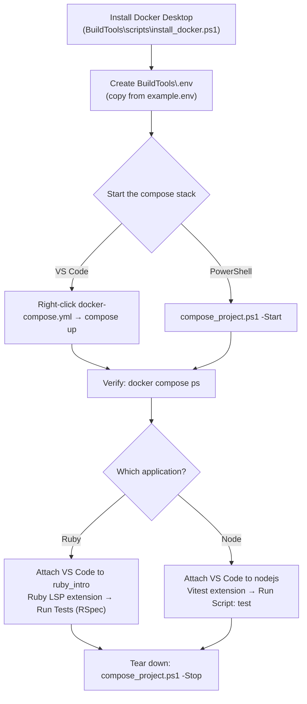
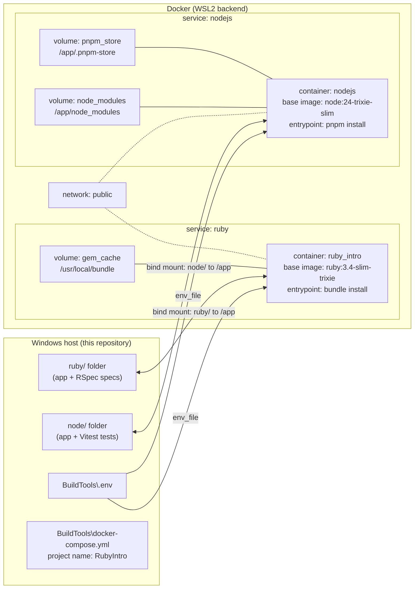

# CSC ECE 517 Project 1

This repository contains two small example applications and a shared Docker toolchain
for running and testing them:

| Service | Container name | Base image           | App directory | Test runner |
| ------- | -------------- | -------------------- | ------------- | ----------- |
| ruby    | ruby_intro     | ruby:3.4-slim-trixie | ruby/         | RSpec       |
| nodejs  | nodejs         | node:24-trixie-slim  | node/         | Vitest      |

Each application includes a small example (a string matching function) and a matching
test so you can practice writing and running tests inside a container.



## Install Docker Desktop
You can use the install_docker.ps1 powershell script to install docker
If doing so ensure you are using an **administrative prompt**
- Click on your Start Windows Icon
- Search for Powershell
- Right-Click on Powershell and select `Run as Administrator`
- Then cd to the directory this repository lives in

```
& BuildTools\scripts\install_docker.ps1
```

When installing docker desktop, it will enable the WSL feature, since we run docker on wsl

**Notes:**
- If WSL wasn't previously enabled you will need to restart and run the installer a second time to ensure
WSL is installed and available for Docker
- Your computer must also support Virtualization which is a BIOS setting, if it's not enabled, you may need to enable it
  within your BIOS settings

## VSCode
**_Docker Desktop must be installed first_**

### Deploy Docker Compose Stack

> **Prerequisite - create the `.env` file**
> The compose file expects a `.env` file in the `BuildTools` folder. Since `.env` is
> git-ignored, copy the provided template first:
>
> ```powershell
> Copy-Item BuildTools\example.env BuildTools\.env
> ```
>
> Without this file, `compose up` fails with an "env file ... not found" error.

Expand the BuildTools Folder

Right-Click docker-compose.yml and click compose up

> Note: For windows users
> 
> There is a compose_project.ps1 script that will start up and destroy the docker compose project for you
> Run ./BuildTools/scripts/compose_project.ps1 in Powershell to read how to use it

### The compose stack



The app code lives on your machine and is bind-mounted into each container at `/app`, so
code changes are picked up immediately. The named volumes persist the installed
dependencies (`gem_cache`, `pnpm_store`, `node_modules`) between container restarts and
rebuilds. Both services share the `public` network and are kept alive by their default
`sleep infinity` command, so you can attach and interact with them.

### Verify the stack is running

```powershell
docker compose -f BuildTools\docker-compose.yml ps
```

You should see the `ruby_intro` and `nodejs` containers in a `running` state.
If a container shows `Restarting` instead, read its logs to see why it keeps failing:

Example to view the ruby_intro logs

```powershell
docker compose -f BuildTools\docker-compose.yml logs --tail 50 ruby_intro
```

### Rebuilding the image

`compose up` only builds an image if it does not exist yet. If you change a `dockerfile`,
the `Gemfile`, or the `package.json`, rebuild and restart the services:

```powershell
docker compose -f BuildTools\docker-compose.yml up -d --build
```

### Customizing the Ruby and Node versions

The base images are controlled by the build args in `BuildTools\docker-compose.yml`:

```yaml
args:
  - RUBY_VERSION=3.4
  - RUBY_OS=slim-trixie
```

These match the `ARG` defaults in `BuildTools\ruby\dockerfile` and are interpolated into the
`FROM` line, so the image is built from `ruby:3.4-slim-trixie`. Change the values to any
existing upstream tag (for example `RUBY_VERSION=3.3` with `RUBY_OS=slim-bookworm`, or
`NODE_VERSION=22` with `NODE_OS=bookworm`) and rebuild with `up -d --build`.
Switching versions changes the base image, so expect a full rebuild.

### Connecting to a container with VSCode

Ensure you have the Container Tools extension by Microsoft installed

- Click on the ContainerTools icon in your sidebar. 
- Expand the "Containers" section
- Expand the rubyintro project
- Right-click on the nodejs or ruby_intro container that's running
- Select "Attach Visual Studio Code"
  - this will launch a new VS Code instance that is running within the container

You are now able to interact with the docker container's code directly

## Running Tests on NodeJS container
- Connect to the NodeJS container
- Install the Vitest Extension
- After you install the vitest extension it will ask you to restart vscode to see the extension
- Press CTRL + SHIFT + P to open the command palette
- Enter "Developer: Restart Extension Host", this will reload the vscode instance connected to the container
- When you see "Cannot reconnect. Please reload the window." Press "Reload Window"

Write your typescript file and test file.  An example .ts and .test.ts is included

To run a test, click on the Run/Debug icon in the left navbar. 

Click the green play button at the top of the screen beside Run and Debug.

Beside the play button there's a dropdown.  Select `Node.js...` then select `Run Script: test`

The call stack will show the tests running.  The bottom center of the screen will show a DEBUG CONSOLE

Your test results will then be displayed in the terminal window tab.

> NOTE:
> 
> From the `Node.js...` selection you can also select `Run Script: test:watch`.
> This will watch your changes and when you press save the tests immediately run.

To stop a test at the top center of the screen press the stop icon.

## Running Tests on the Ruby_Intro container
- Connect to the Ruby_Intro container
- Install the Ruby LSP Extension
- After you install the Ruby LSP extension you should see it in the sidebar 

Write your ruby file and spec file.  Spec files go in the spec folder suffixed with _spec.rb.
An example .rb and _spec.rb file is included in the container.

To run a test, Right-click on the spec folder and select Run Tests

The terminal window will open and run the tests showing you the output of your tests.

If you have errors, you can open your _spec.rb file and it'll give you an indication of what group of tests are failing.

You can also see how your tests performed by expanding the Ruby LSP extension and navigate the spec tree displayed after you've ran the test.


## Tear down the docker project

```powershell
.\BuildTools\scripts\compose_project.ps1 -Stop
```

Unless you pass `-RemoveVolumes` or `-RemoveImages`, you will be prompted about cleaning up
the associated docker volumes and images.

- `-RemoveVolumes` removes the named volumes defined in the compose file. The volumes keep
  installed dependencies (`gem_cache`, `pnpm_store`, `node_modules`) so builds and installs
  are faster next time - they are kept on purpose. If you do not clean them up, you will have
  to remove them manually later to avoid disk space issues.
- `-RemoveImages` removes the built images. NOTE: removing the images means the project will
  do a full rebuild the next time it is started.

To skip the prompts entirely:

```powershell
.\BuildTools\scripts\compose_project.ps1 -Stop -RemoveVolumes -RemoveImages
```

## Troubleshooting

- **Docker Desktop is not running** - start it from your Start menu (or run
  `.\BuildTools\scripts\install_docker.ps1`, which will start it for you) and try again.
- **WSL errors on first use** - if WSL was enabled recently, reboot your machine and run the
  installer script a second time.
- **A container is in a `Restarting` state** - inspect its logs:
  `docker compose -f BuildTools\docker-compose.yml logs --tail 50 ruby_intro`
  (use `nodejs` for the Node service).
- **Nothing in the container changed after I edited files** - the app code is bind-mounted
  from your repo, so code changes are picked up automatically. Only image-level changes
  (dockerfile, Gemfile, package.json) require a rebuild with `up -d --build`.
